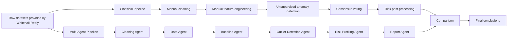
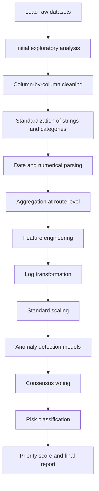
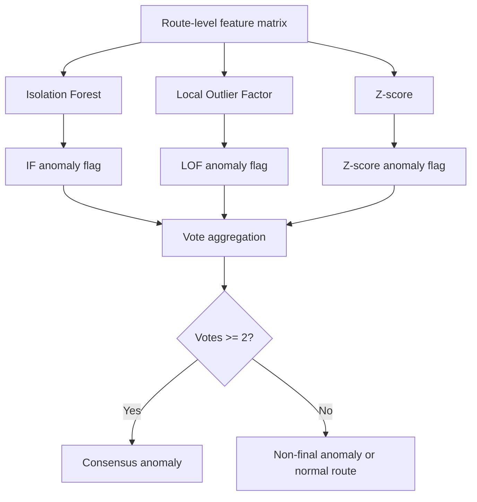
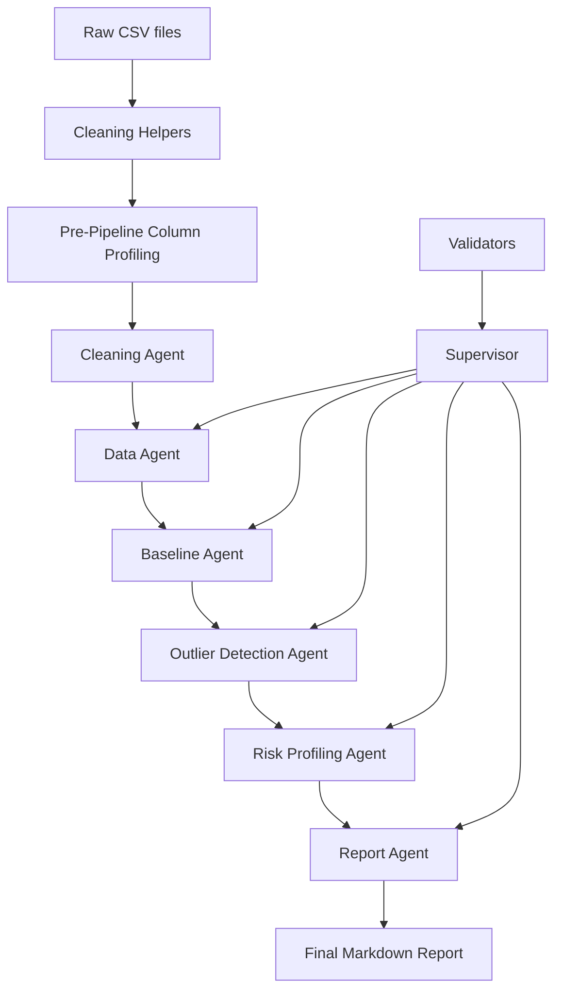
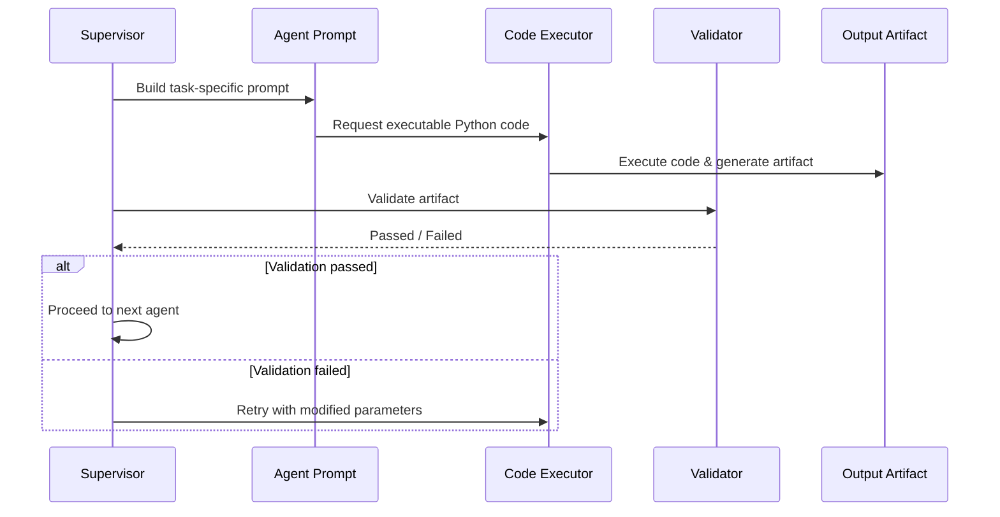
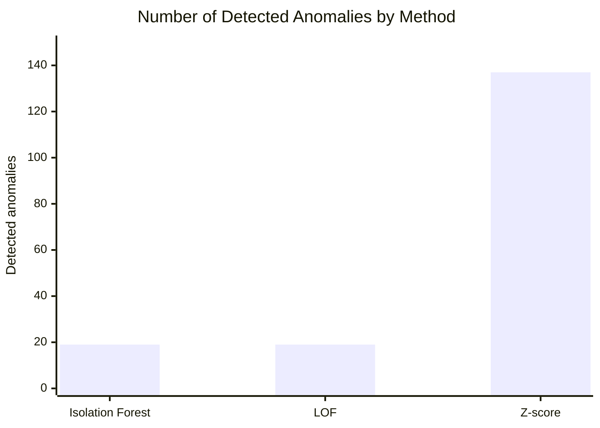
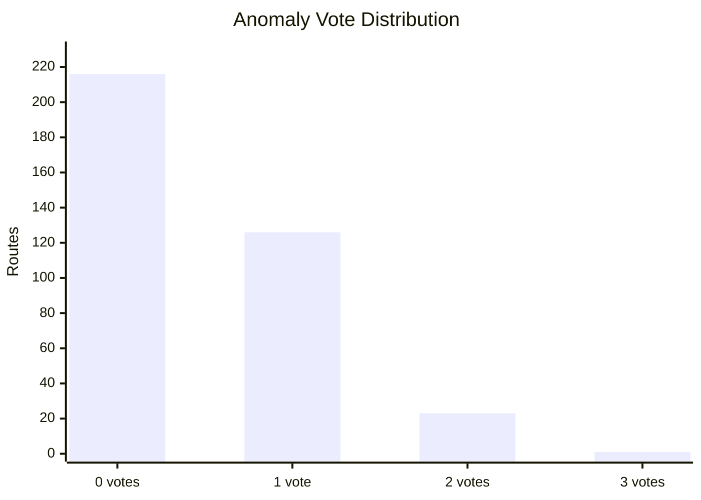
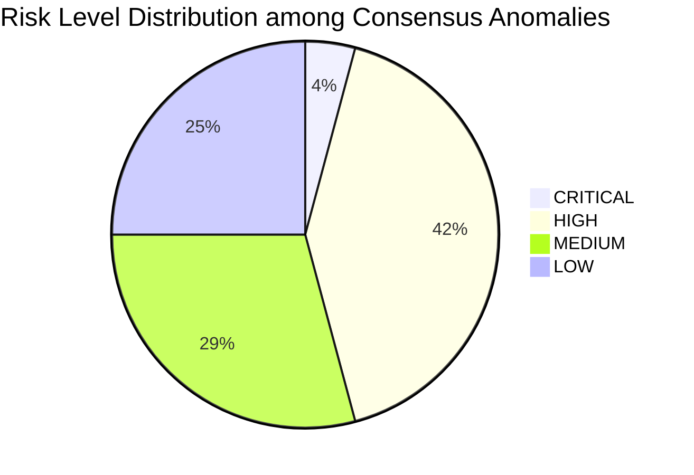

# Classical vs Multi-Agent Pipeline for Anomaly Detection

## Team Members

- **Stefano Losurdo** — Captain  
- **Michele Baldo**  
- **Matteo Perrucci**  

**Company:** Whitehall Reply  
**Project type:** Machine Learning project — Anomaly Detection  
**Main notebook:** `main.ipynb`  
**Data folder:** `data/`

---

## [Section 1] Introduction

This project focuses on **anomaly detection in airport transit and passenger-related data** provided by **Whitehall Reply**. The goal is to identify abnormal routes or route-level patterns that may require further operational investigation.

The work compares two different approaches:

1. a **Classical Pipeline**, manually designed and implemented step by step;
2. a **Multi-Agent Pipeline**, where multiple specialized agents collaborate to automate parts of the machine learning workflow.

The main objective is not only to detect anomalies, but also to understand how the two approaches differ in terms of:

- data preparation effort;
- transparency and interpretability;
- anomaly detection quality;
- operational usability;
- degree of automation;
- robustness of the final output.

The problem is framed as an **unsupervised anomaly detection task**, since the available data does not provide a fully reliable ground-truth label indicating which routes are truly anomalous. For this reason, the project relies on statistical signals, unsupervised learning models, consensus logic, and post-processing rules to obtain an interpretable final ranking of suspicious routes.

---

## Project Overview

The project develops from an initial fully manual pipeline toward a more automated agent-based system.



---

## Dataset Description

The analysis uses two datasets provided by Whitehall Reply:

- `ALLARMI.csv`
- `TIPOLOGIA_VIAGGIATORE.csv`

The first dataset contains information related to alarms, routes, airports, years, months, and operational alarm categories.  
The second dataset contains traveller-type information, including route-level details and variables related to passenger categories, document types, inspection outcomes, and alert rates.

Both datasets required extensive preprocessing because they contained heterogeneous formats, textual inconsistencies, missing values, repeated categories, placeholder values, and non-standard representations of numerical and date-related fields.

The final route-level dataset used by the classical pipeline contains:

- **366 routes**
- **30 engineered numerical features**
- route identifiers based on departure and arrival airports
- alarm-related aggregated features
- traveller-related aggregated features
- alert-rate features
- nationality and document-type related indicators
- inspection outcome percentages

---

## [Section 2] Methods

## 2.1 Classical Pipeline

The Classical Pipeline was developed manually and follows a traditional machine learning workflow.



### Data Cleaning

The first part of the notebook performs a detailed cleaning process.  
The main operations include:

- conversion of string columns to lowercase;
- removal of leading and trailing whitespaces;
- normalization of inconsistent categorical values;
- mapping of semantically equivalent labels into common categories;
- parsing and standardization of year and month fields;
- conversion of noisy numerical fields into usable numeric types;
- removal or replacement of placeholder values such as missing, undefined, or non-informative tokens;
- harmonization of airport and country information;
- consistency checks between related columns.

This step is essential because anomaly detection is highly sensitive to data quality. Inconsistent values or wrongly parsed numerical fields may generate artificial anomalies.

---

### Route-Level Feature Engineering

The data was transformed into a route-level representation.  
Each row in the modeling dataset represents a route identified by:

- departure airport;
- arrival airport.

For each route, the pipeline computes aggregated features such as:

- total alarms closed;
- total generated alarms;
- total relevant alarms;
- total negative outcomes;
- total investigated travellers;
- total alerted travellers;
- total available flights;
- total investigated flights;
- total travellers entered into the system;
- alert rate;
- nationality-specific alert rates;
- document-type alert rates;
- percentages of different inspection outcomes.

The final modeling matrix contains **30 numerical features**.

---

### Transformation and Scaling

The engineered features are highly skewed and zero-inflated. Many routes have zero values for several alarm-related variables, while a few routes show much higher volumes.

To reduce the impact of extreme values, the Classical Pipeline applies:

```python
X_log = np.log1p(X)
```

This transformation compresses large values while preserving zero values.

After the logarithmic transformation, the features are scaled using:

```python
StandardScaler()
```

The resulting feature matrix has shape:

```text
(366, 30)
```

with mean approximately equal to 0 and standard deviation approximately equal to 1.

---

## 2.2 Baseline Construction

Since the available data is aggregated at route level and does not contain a sufficiently long time series, the pipeline builds a **cross-sectional baseline** across all routes.

The global distribution of each feature is used as the reference for identifying abnormal behavior.  
For example, the global baseline for `tasso_allarme` is:

| Statistic | Value |
|---|---:|
| Median alert rate | 0.1750 |
| 75th percentile | 0.2500 |
| 90th percentile | 0.4722 |
| 2× median threshold | 0.3501 |
| 3× median threshold | 0.5251 |

The 3× median threshold is later used during post-processing to identify high-risk routes based on alert rate.

---

## 2.3 Anomaly Detection Models

The Classical Pipeline applies three anomaly detection methods:

| Method | Type | Role in the pipeline |
|---|---|---|
| Isolation Forest | Tree-based unsupervised anomaly detection | Detects globally isolated observations |
| Local Outlier Factor | Density-based unsupervised anomaly detection | Detects locally sparse observations |
| Z-score | Statistical rule-based method | Detects feature-level extreme deviations |

### Isolation Forest

Isolation Forest was configured with:

```python
IsolationForest(
    n_estimators=200,
    contamination=0.05,
    random_state=42
)
```

It detected:

```text
19 anomalous routes out of 366
```

corresponding to:

```text
5.2%
```

This is consistent with the chosen contamination value of 5%.

---

### Local Outlier Factor

Local Outlier Factor was configured with:

```python
LocalOutlierFactor(
    n_neighbors=20,
    contamination=0.05
)
```

It also detected:

```text
19 anomalous routes out of 366
```

corresponding to:

```text
5.2%
```

LOF differs from Isolation Forest because it compares each route with its local neighborhood. This makes it useful for detecting routes that are not globally extreme but are unusual compared with similar routes.

---

### Z-score

The Z-score method flags a route as anomalous if at least one feature has an absolute standardized value greater than 3:

```python
Z_THRESH = 3.0
```

It detected:

```text
137 anomalous routes out of 366
```

corresponding to:

```text
37.4%
```

This result shows that Z-score is much more sensitive than Isolation Forest and LOF.  
The features most frequently exceeding the threshold were:

| Feature | Routes exceeding threshold |
|---|---:|
| `alert_rate_permesso` | 17 |
| `alert_rate_visto` | 17 |
| `alert_rate_afg` | 17 |
| `alert_rate_passaporto` | 15 |
| `alert_rate_alb` | 15 |

The high number of Z-score flags suggests that using Z-score alone would generate too many alerts for practical operational use. For this reason, the final Classical Pipeline uses a consensus mechanism.

---

## 2.4 Consensus Strategy

Each model assigns a binary anomaly flag:

- `1` if the route is anomalous;
- `0` otherwise.

The final anomaly signal is based on the number of votes received by each route.



The vote distribution was:

| Votes | Number of routes | Interpretation |
|---:|---:|---|
| 0/3 | 216 | Normal routes |
| 1/3 | 126 | Weak anomaly signal |
| 2/3 | 23 | Probable anomaly |
| 3/3 | 1 | Strongest anomaly signal |

The consensus rule is:

```text
A route is a final anomaly if it receives at least 2 votes out of 3.
```

This produced:

```text
24 consensus anomalies
```

Compared with the 137 routes flagged by Z-score alone, the consensus strategy reduces the alert set to a more manageable and more reliable group of routes.

---

## 2.5 Post-Processing and Risk Classification

The raw anomaly flags are not sufficient for operational use.  
For this reason, the Classical Pipeline includes a post-processing phase that assigns risk levels and priority scores.

The risk classification uses:

- anomaly votes;
- alert rate;
- number of investigated travellers;
- absolute number of alarms;
- data quality notes;
- confidence intervals;
- business rules based on operational interpretability.

The risk levels are:

| Risk level | Meaning |
|---|---|
| CRITICAL | Flagged by all three methods |
| HIGH | High alert rate or strong operational signal |
| MEDIUM | Relevant signal, often driven by high volume |
| LOW | Weak or lower-priority signal |

The classification output contains:

| Risk level | Number of routes |
|---|---:|
| CRITICAL | 1 |
| HIGH | 10 |
| MEDIUM | 7 |
| LOW | 6 |

However, not all 24 consensus anomalies are equally reliable.  
The post-processing phase identifies:

- **3 likely false positives**, caused by features unrelated to alert rate;
- **2 incomplete-data routes**, where alert rate is present but supporting traveller records are missing;
- **5 high-alert-rate low-volume routes**, which require caution because the confidence interval is wide.

After excluding unreliable cases, the final report focuses on:

```text
19 reliable routes
```

---

## 2.6 Priority Score

A priority score is computed to rank the reliable anomalous routes.

The score combines:

- **60% alert rate**
- **40% logarithm of absolute alarms**

```text
priority_score = 0.60 * normalized_alert_rate
               + 0.40 * normalized_log_absolute_alarms
```

This score balances two different operational perspectives:

1. routes with very high alert rates;
2. routes with high absolute alarm volume.

A route with a very high alert rate but very low volume may be interesting, but it should be interpreted with caution.  
A route with a lower alert rate but very high volume may be operationally important because it generates more absolute alarms.

---

## 2.7 Multi-Agent Pipeline

The second part of the project implements a Multi-Agent Pipeline.  
The goal is to automate the workflow by assigning different responsibilities to specialized agents.



The Multi-Agent Pipeline includes the following components:

### Cleaning Helpers

Reusable functions for:

- accent stripping;
- string normalization;
- missing-value detection;
- type inference;
- robust parsing of noisy values.

### Column Profiling

Before executing the pipeline, each dataset is profiled to understand:

- column names;
- dominant formats;
- missing values;
- likely semantic meaning of each field;
- sample values.

This profiling phase helps the agents reason about the structure of the input datasets.

### Code Executor

The Code Executor receives task instructions and generates executable Python code.  
It is constrained to return only executable Python code, without explanations or markdown.

### Validators

Each agent output is checked by deterministic validators.  
This is a key design choice because it reduces the risk of accepting invalid LLM-generated outputs.

The validators check whether:

- the expected output file exists;
- the file is loadable;
- required columns are present;
- the dataframe is not empty;
- the values satisfy basic consistency rules.

### Supervisor

The Supervisor orchestrates the execution of each agent.

For every task, it:

1. sends the task prompt to the Code Executor;
2. runs the generated code;
3. validates the output;
4. retries if execution or validation fails;
5. stores logs, generated code, validation results, and success status.



---

## Multi-Agent Components

### Data Agent

The Data Agent filters the cleaned transit datasets based on a natural language query.

In the notebook, the example query is:

```text
mostrami le anomalie per i voli diretti a fiumicino
```

The agent:

- selects the most appropriate dataset;
- identifies the correct arrival-airport column;
- maps the query to the value `fiumicino`;
- filters records related to routes arriving at Fiumicino;
- focuses on alarm-related records;
- writes the result to `scoped_transit_data.csv`.

For the example query, the Data Agent selected the alarm dataset and produced:

```text
139 rows and 24 columns
```

---

### Baseline Agent

The Baseline Agent builds a route-level baseline from the scoped data.

It:

- loads `scoped_transit_data.csv`;
- identifies departure and arrival columns;
- builds a route feature;
- aggregates by route;
- computes total alarms;
- computes number of records;
- computes alert rate;
- computes baseline statistics;
- writes `baseline_data.csv`.

For the Fiumicino query, the Baseline Agent produced:

```text
46 routes and 6 columns
```

---

### Outlier Detection Agent

The Outlier Detection Agent loads the baseline data and computes anomaly signals.

It uses:

- `z_score`;
- `ratio_to_baseline`;
- a combined `anomaly_score`.

It then selects the top 5% most anomalous routes.

For the Fiumicino query, it produced:

```text
2 outliers
```

The detected routes were:

| Route | Total alarms | Records | Alert rate | Z-score | Anomaly score |
|---|---:|---:|---:|---:|---:|
| LGW → FCO | 11 | 11 | 1.0 | 2.9617 | 27.9617 |
| LHR → FCO | 11 | 11 | 1.0 | 2.9617 | 27.9617 |

---

### Risk Profiling Agent

The Risk Profiling Agent converts outliers into risk categories.

For the Fiumicino query, it classified both detected outliers as:

```text
LOW risk
```

This result is important because it shows that the Multi-Agent Pipeline separates **statistical anomaly detection** from **risk prioritization**.  
A route may be statistically unusual but still receive a low operational priority if the scoring logic does not identify it as severe.

---

### Report Agent

The Report Agent generates a final narrative report in markdown format.

The report includes:

- executive summary;
- risk distribution;
- top high-risk routes;
- other monitored routes;
- main anomaly drivers;
- interpretation of the results.

For the example query, the report summarized:

- 2 flagged routes;
- 0 HIGH risk routes;
- 0 MEDIUM risk routes;
- 2 LOW risk routes.

---

## [Section 3] Experimental Design

## Experiment 1 — Classical Pipeline Anomaly Detection

### Purpose

The purpose of this experiment is to evaluate whether a manually designed unsupervised pipeline can identify route-level anomalies from the available operational and traveller-related datasets.

### Baselines

The baseline is the global cross-sectional distribution of all 366 routes.

The anomaly detection methods compared are:

- Isolation Forest;
- Local Outlier Factor;
- Z-score.

### Metrics

Since no reliable ground truth labels are available, the evaluation focuses on unsupervised and operational metrics:

- number of flagged anomalies;
- percentage of flagged anomalies;
- agreement between methods;
- number of consensus anomalies;
- interpretability of flagged routes;
- operational usefulness after post-processing.

---

## Experiment 2 — Consensus Voting

### Purpose

The purpose of this experiment is to reduce false positives and obtain a more robust anomaly set by combining multiple anomaly detection signals.

### Baseline

The main comparison is against each single detector:

- Isolation Forest alone;
- LOF alone;
- Z-score alone.

### Evaluation Logic

A route is considered a final anomaly only if at least two out of three methods flag it.

This allows the pipeline to:

- preserve strong anomaly signals;
- reduce the noise introduced by overly sensitive methods;
- obtain a smaller and more actionable anomaly set.

---

## Experiment 3 — Risk Post-Processing

### Purpose

The purpose of this experiment is to transform raw anomaly flags into operational risk categories.

### Baseline

The baseline is the set of 24 consensus anomalies.

### Evaluation Logic

The post-processing step evaluates:

- alert rate;
- absolute alarms;
- investigated passenger volume;
- anomaly votes;
- confidence intervals;
- data quality notes.

The final output is a ranked set of reliable routes with a priority score.

---

## Experiment 4 — Multi-Agent Pipeline

### Purpose

The purpose of this experiment is to evaluate whether an agent-based system can reproduce parts of the anomaly detection workflow in a more automated and modular way.

### Baseline

The baseline is the Classical Pipeline.

### Evaluation Criteria

The Multi-Agent Pipeline is evaluated in terms of:

- ability to interpret a natural language query;
- ability to select and filter the correct dataset;
- ability to build a route-level baseline;
- ability to detect outliers;
- ability to assign risk levels;
- ability to generate a final textual report;
- robustness through deterministic validation.

---

## [Section 4] Results

## 4.1 Classical Pipeline Results

The Classical Pipeline analyzed:

```text
366 total routes
```

with:

```text
30 engineered features
```

The individual anomaly detectors produced the following results:

| Method | Anomalies detected | Percentage |
|---|---:|---:|
| Isolation Forest | 19 / 366 | 5.2% |
| Local Outlier Factor | 19 / 366 | 5.2% |
| Z-score | 137 / 366 | 37.4% |

The main finding is that Isolation Forest and LOF are conservative and aligned with the selected contamination rate, while Z-score is much more sensitive.



The vote distribution was:

| Number of votes | Routes |
|---:|---:|
| 0 | 216 |
| 1 | 126 |
| 2 | 23 |
| 3 | 1 |



The consensus approach produced:

```text
24 final anomalies
```

This represents a strong reduction compared with Z-score alone:

```text
137 Z-score flags → 24 consensus anomalies
```

This reduction is important because it makes the final output more suitable for operational review.

---

## 4.2 Risk Classification Results

The 24 consensus anomalies were classified as follows:

| Risk level | Routes |
|---|---:|
| CRITICAL | 1 |
| HIGH | 10 |
| MEDIUM | 7 |
| LOW | 6 |



After data-quality filtering:

```text
19 reliable routes
```

were retained for the final operational report.

The post-processing step excluded or marked with caution:

| Issue type | Routes |
|---|---:|
| Likely false positives | 3 |
| Incomplete data | 2 |
| High rate but very low volume | 5 |

This distinction is crucial because an anomaly detector can identify statistically unusual routes, but not all statistically unusual routes are equally useful or reliable from an operational perspective.

---

## 4.3 Main Classical Pipeline Findings

The Classical Pipeline shows that:

1. **Z-score is highly sensitive**  
   It detects 137 routes, which is too many for direct operational use.

2. **Isolation Forest and LOF are more selective**  
   Both detect 19 routes, consistent with the 5% contamination assumption.

3. **Consensus voting improves reliability**  
   The final consensus set contains 24 routes, reducing noise while preserving strong signals.

4. **Risk post-processing is necessary**  
   Raw anomaly flags must be interpreted using alert rate, volume, and data quality.

5. **High alert rate does not always mean high reliability**  
   Some routes have very high rates but very low investigated volume, resulting in wide confidence intervals.

6. **High-volume routes can be operationally important even with moderate rates**  
   Medium-risk routes may be important because they generate many absolute alarms.

---

## 4.4 Multi-Agent Pipeline Results

The Multi-Agent Pipeline was tested using the query:

```text
mostrami le anomalie per i voli diretti a fiumicino
```

The agentic workflow produced the following artifacts:

| Step | Output | Result |
|---|---|---:|
| Data Agent | `scoped_transit_data.csv` | 139 rows |
| Baseline Agent | `baseline_data.csv` | 46 routes |
| Outlier Detection Agent | `outliers.csv` | 2 outliers |
| Risk Profiling Agent | `risk_report.csv` | 2 LOW-risk routes |
| Report Agent | `transit_anomaly_report.md` | narrative report |

The detected routes were:

| Route | Alert rate | Total alarms | Risk level |
|---|---:|---:|---|
| LGW → FCO | 1.0 | 11 | LOW |
| LHR → FCO | 1.0 | 11 | LOW |

The Multi-Agent Pipeline successfully executed all steps and generated valid artifacts at each stage.

---

## 4.5 Classical vs Multi-Agent Comparison

| Dimension | Classical Pipeline | Multi-Agent Pipeline |
|---|---|---|
| Scope | Full dataset | Query-driven scoped dataset |
| Main input | Cleaned and engineered route-level data | Natural language query + cleaned datasets |
| Human effort | High | Lower once agents are configured |
| Control | Very high | Medium, mediated by prompts and validators |
| Transparency | High | Medium-high if generated code and logs are inspected |
| Robustness | Depends on manual code quality | Depends on validators and supervisor |
| Output | Ranked anomaly report | Query-specific risk report |
| Best use case | Full analytical study | Interactive or repeatable operational querying |
| Main weakness | Time-consuming and less reusable | Sensitive to prompt design and validation quality |

---

## 4.6 Interpretation of the Comparison

The Classical Pipeline is stronger when the goal is to perform a complete, rigorous, and fully controlled analysis.  
It provides more detailed feature engineering, more explicit modeling choices, and a richer post-processing logic.

The Multi-Agent Pipeline is stronger when the goal is to create a reusable system that can respond to different user queries and generate outputs automatically.  
Its main advantage is modularity: each agent has a specific responsibility, and the Supervisor ensures that invalid artifacts are rejected.

However, the Multi-Agent Pipeline currently produces a more limited analysis than the Classical Pipeline. In the tested example, it focuses on routes arriving at Fiumicino and detects only two outliers. This makes the output useful for a scoped operational question, but not directly comparable to the full 366-route analysis unless the same scope and features are used.

The most important conclusion is that the two approaches are complementary:

- the **Classical Pipeline** is better for controlled experimentation and methodological validation;
- the **Multi-Agent Pipeline** is better for automation, reusability, and interactive querying.

---


## [Section 5] Conclusions

This project shows that anomaly detection on airport transit data requires both statistical modeling and careful post-processing. The Classical Pipeline demonstrates that different anomaly detection methods can produce very different levels of sensitivity: Isolation Forest and LOF detect a small and controlled set of anomalies, while Z-score identifies many more feature-level deviations. The consensus strategy provides a practical compromise by selecting only routes flagged by at least two methods, reducing the anomaly set from 137 Z-score flags to 24 consensus anomalies. After additional data-quality filtering, 19 reliable routes are retained for operational interpretation.

The Multi-Agent Pipeline demonstrates that the same type of workflow can be partially automated through specialized agents, deterministic validators, and a supervisor mechanism. The agentic system can interpret a natural language query, filter the relevant data, build a route-level baseline, detect outliers, assign risk categories, and generate a narrative report. This makes the approach promising for interactive analysis and repeated operational use.

Overall, the main takeaway is that the Classical Pipeline offers greater methodological control and interpretability, while the Multi-Agent Pipeline offers greater modularity and automation. A strong future direction would be to combine the two approaches: use the robust feature engineering and consensus logic of the Classical Pipeline inside the automated structure of the Multi-Agent Pipeline.

---

## Limitations and Future Work

The main limitations of the project are:

- the absence of a reliable ground-truth label for anomalies;
- the limited temporal window available in the data;
- the need to rely on unsupervised evaluation criteria;
- the sensitivity of some results to low-volume routes;
- the possibility of false positives caused by rare but not necessarily risky feature patterns;
- the current difference in scope between the full Classical Pipeline and the query-driven Multi-Agent Pipeline.

Future work could include:

- collecting a longer historical time window;
- introducing time-series baselines and seasonal decomposition;
- validating detected anomalies with domain experts;
- adding supervised labels if confirmed anomaly cases become available;
- integrating the Classical Pipeline's consensus logic into the Multi-Agent Pipeline;
- improving the Risk Profiling Agent with confidence intervals and data-quality flags;
- extending the Gradio interface for interactive exploration;
- generating all final README figures automatically from the notebook.

---

## Repository Structure

```text
.
├── main.ipynb
├── README.md
├── data/
│   └── raw/
│       ├── ALLARMI.csv
│       └── TIPOLOGIA_VIAGGIATORE.csv
├── output/
│   ├── scoped_transit_data.csv
│   ├── baseline_data.csv
│   ├── outliers.csv
│   ├── risk_report.csv
│   └── transit_anomaly_report.md
└── requirements.txt
```

---

## Reproducibility

To reproduce the project:

1. Clone the repository.
2. Place the raw datasets in `data/raw/`.
3. Install the required dependencies.
4. Run `main.ipynb` from top to bottom.
5. Ensure that all generated figures are saved in the `images/` folder.
6. Verify that the output artifacts are created correctly.

Example installation:

```bash
pip install -r requirements.txt
```

# API Key

This project requires a Mistral API key to run the Multi-Agent Pipeline.

For the purpose of evaluation, the API key is provided below:

```bash
MISTRAL_API_KEY=6H9hgqBwYfQSjKp37F5zr1TWnyMTYitV
```

To use it locally, set it as an environment variable:

```bash
export MISTRAL_API_KEY=6H9hgqBwYfQSjKp37F5zr1TWnyMTYitV
```


Main Python libraries used:

- `pandas`
- `numpy`
- `scipy`
- `scikit-learn`
- `matplotlib`
- `seaborn`
- `gradio`
- `python-dotenv`
- `openai`

---

## Notes on Academic Integrity