# Classical vs Multi-Agent Pipeline for Anomaly Detection

## Team Members

- **Stefano Losurdo** — Captain  
- **Michele Baldo**  
- **Matteo Perrucci**  

**Company:** Whitehall Reply  
**Project type:** Machine Learning project — Anomaly Detection  
**Main notebook:** `main.ipynb`  
**Data folder:** `data/`

---

## [Section 1] Introduction

This project focuses on **anomaly detection in airport transit and passenger-related data** provided by **Whitehall Reply**. The goal is to identify abnormal routes or route-level patterns that may require further operational investigation.

The work compares two different approaches:

1. a **Classical Pipeline**, manually designed and implemented step by step;
2. a **Multi-Agent Pipeline**, where multiple specialized agents collaborate to automate parts of the machine learning workflow.

The main objective is not only to detect anomalies, but also to understand how the two approaches differ in terms of:

- data preparation effort;
- transparency and interpretability;
- anomaly detection quality;
- operational usability;
- degree of automation;
- robustness of the final output.

The problem is framed as an **unsupervised anomaly detection task**, since the available data does not provide a fully reliable ground-truth label indicating which routes are truly anomalous. For this reason, the project relies on statistical signals, unsupervised learning models, consensus logic, and post-processing rules to obtain an interpretable final ranking of suspicious routes.

---

## Project Overview

The project develops from an initial fully manual pipeline toward a more automated agent-based system.

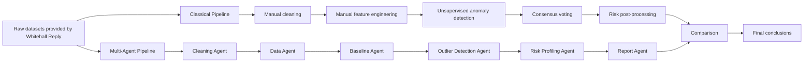

---

## Dataset Description

The analysis uses two datasets provided by Whitehall Reply:

- `ALLARMI.csv`
- `TIPOLOGIA_VIAGGIATORE.csv`

The first dataset contains information related to alarms, routes, airports, years, months, and operational alarm categories.  
The second dataset contains traveller-type information, including route-level details and variables related to passenger categories, document types, inspection outcomes, and alert rates.

Both datasets required extensive preprocessing because they contained heterogeneous formats, textual inconsistencies, missing values, repeated categories, placeholder values, and non-standard representations of numerical and date-related fields.

The final route-level dataset used by the classical pipeline contains:

- **366 routes**
- **30 engineered numerical features**
- route identifiers based on departure and arrival airports
- alarm-related aggregated features
- traveller-related aggregated features
- alert-rate features
- nationality and document-type related indicators
- inspection outcome percentages

---

## [Section 2] Methods

## 2.1 Classical Pipeline

The Classical Pipeline was developed manually and follows a traditional machine learning workflow.

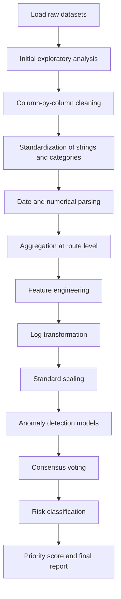

### Data Cleaning

The first part of the notebook performs a detailed cleaning process.  
The main operations include:

- conversion of string columns to lowercase;
- removal of leading and trailing whitespaces;
- normalization of inconsistent categorical values;
- mapping of semantically equivalent labels into common categories;
- parsing and standardization of year and month fields;
- conversion of noisy numerical fields into usable numeric types;
- removal or replacement of placeholder values such as missing, undefined, or non-informative tokens;
- harmonization of airport and country information;
- consistency checks between related columns.

This step is essential because anomaly detection is highly sensitive to data quality. Inconsistent values or wrongly parsed numerical fields may generate artificial anomalies.

---

### Route-Level Feature Engineering

The data was transformed into a route-level representation.  
Each row in the modeling dataset represents a route identified by:

- departure airport;
- arrival airport.

For each route, the pipeline computes aggregated features such as:

- total alarms closed;
- total generated alarms;
- total relevant alarms;
- total negative outcomes;
- total investigated travellers;
- total alerted travellers;
- total available flights;
- total investigated flights;
- total travellers entered into the system;
- alert rate;
- nationality-specific alert rates;
- document-type alert rates;
- percentages of different inspection outcomes.

The final modeling matrix contains **30 numerical features**.

---

### Transformation and Scaling

The engineered features are highly skewed and zero-inflated. Many routes have zero values for several alarm-related variables, while a few routes show much higher volumes.

To reduce the impact of extreme values, the Classical Pipeline applies:

```python
X_log = np.log1p(X)
```

This transformation compresses large values while preserving zero values.

After the logarithmic transformation, the features are scaled using:

```python
StandardScaler()
```

The resulting feature matrix has shape:

```text
(366, 30)
```

with mean approximately equal to 0 and standard deviation approximately equal to 1.

---

## 2.2 Baseline Construction

Since the available data is aggregated at route level and does not contain a sufficiently long time series, the pipeline builds a **cross-sectional baseline** across all routes.

The global distribution of each feature is used as the reference for identifying abnormal behavior.  
For example, the global baseline for `tasso_allarme` is:

| Statistic | Value |
|---|---:|
| Median alert rate | 0.1750 |
| 75th percentile | 0.2500 |
| 90th percentile | 0.4722 |
| 2× median threshold | 0.3501 |
| 3× median threshold | 0.5251 |

The 3× median threshold is later used during post-processing to identify high-risk routes based on alert rate.

---

## 2.3 Anomaly Detection Models

The Classical Pipeline applies three anomaly detection methods:

| Method | Type | Role in the pipeline |
|---|---|---|
| Isolation Forest | Tree-based unsupervised anomaly detection | Detects globally isolated observations |
| Local Outlier Factor | Density-based unsupervised anomaly detection | Detects locally sparse observations |
| Z-score | Statistical rule-based method | Detects feature-level extreme deviations |

### Isolation Forest

Isolation Forest was configured with:

```python
IsolationForest(
    n_estimators=200,
    contamination=0.05,
    random_state=42
)
```

It detected:

```text
19 anomalous routes out of 366
```

corresponding to:

```text
5.2%
```

This is consistent with the chosen contamination value of 5%.

---

### Local Outlier Factor

Local Outlier Factor was configured with:

```python
LocalOutlierFactor(
    n_neighbors=20,
    contamination=0.05
)
```

It also detected:

```text
19 anomalous routes out of 366
```

corresponding to:

```text
5.2%
```

LOF differs from Isolation Forest because it compares each route with its local neighborhood. This makes it useful for detecting routes that are not globally extreme but are unusual compared with similar routes.

---

### Z-score

The Z-score method flags a route as anomalous if at least one feature has an absolute standardized value greater than 3:

```python
Z_THRESH = 3.0
```

It detected:

```text
137 anomalous routes out of 366
```

corresponding to:

```text
37.4%
```

This result shows that Z-score is much more sensitive than Isolation Forest and LOF.  
The features most frequently exceeding the threshold were:

| Feature | Routes exceeding threshold |
|---|---:|
| `alert_rate_permesso` | 17 |
| `alert_rate_visto` | 17 |
| `alert_rate_afg` | 17 |
| `alert_rate_passaporto` | 15 |
| `alert_rate_alb` | 15 |

The high number of Z-score flags suggests that using Z-score alone would generate too many alerts for practical operational use. For this reason, the final Classical Pipeline uses a consensus mechanism.

---

## 2.4 Consensus Strategy

Each model assigns a binary anomaly flag:

- `1` if the route is anomalous;
- `0` otherwise.

The final anomaly signal is based on the number of votes received by each route.

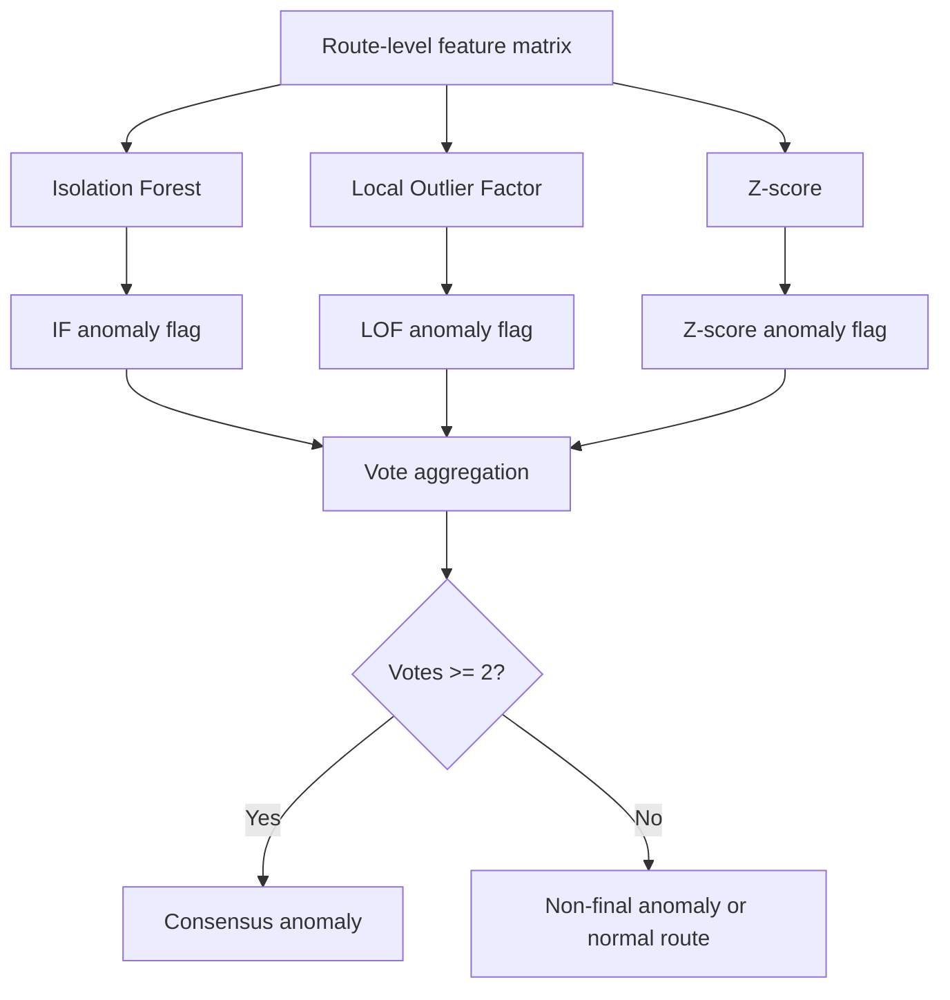

The vote distribution was:

| Votes | Number of routes | Interpretation |
|---:|---:|---|
| 0/3 | 216 | Normal routes |
| 1/3 | 126 | Weak anomaly signal |
| 2/3 | 23 | Probable anomaly |
| 3/3 | 1 | Strongest anomaly signal |

The consensus rule is:

```text
A route is a final anomaly if it receives at least 2 votes out of 3.
```

This produced:

```text
24 consensus anomalies
```

Compared with the 137 routes flagged by Z-score alone, the consensus strategy reduces the alert set to a more manageable and more reliable group of routes.

---

## 2.5 Post-Processing and Risk Classification

The raw anomaly flags are not sufficient for operational use.  
For this reason, the Classical Pipeline includes a post-processing phase that assigns risk levels and priority scores.

The risk classification uses:

- anomaly votes;
- alert rate;
- number of investigated travellers;
- absolute number of alarms;
- data quality notes;
- confidence intervals;
- business rules based on operational interpretability.

The risk levels are:

| Risk level | Meaning |
|---|---|
| CRITICAL | Flagged by all three methods |
| HIGH | High alert rate or strong operational signal |
| MEDIUM | Relevant signal, often driven by high volume |
| LOW | Weak or lower-priority signal |

The classification output contains:

| Risk level | Number of routes |
|---|---:|
| CRITICAL | 1 |
| HIGH | 10 |
| MEDIUM | 7 |
| LOW | 6 |

However, not all 24 consensus anomalies are equally reliable.  
The post-processing phase identifies:

- **3 likely false positives**, caused by features unrelated to alert rate;
- **2 incomplete-data routes**, where alert rate is present but supporting traveller records are missing;
- **5 high-alert-rate low-volume routes**, which require caution because the confidence interval is wide.

After excluding unreliable cases, the final report focuses on:

```text
19 reliable routes
```

---

## 2.6 Priority Score

A priority score is computed to rank the reliable anomalous routes.

The score combines:

- **60% alert rate**
- **40% logarithm of absolute alarms**

```text
priority_score = 0.60 * normalized_alert_rate
               + 0.40 * normalized_log_absolute_alarms
```

This score balances two different operational perspectives:

1. routes with very high alert rates;
2. routes with high absolute alarm volume.

A route with a very high alert rate but very low volume may be interesting, but it should be interpreted with caution.  
A route with a lower alert rate but very high volume may be operationally important because it generates more absolute alarms.

---

## 2.7 Multi-Agent Pipeline

The second part of the project implements a Multi-Agent Pipeline.  
The goal is to automate the workflow by assigning different responsibilities to specialized agents.

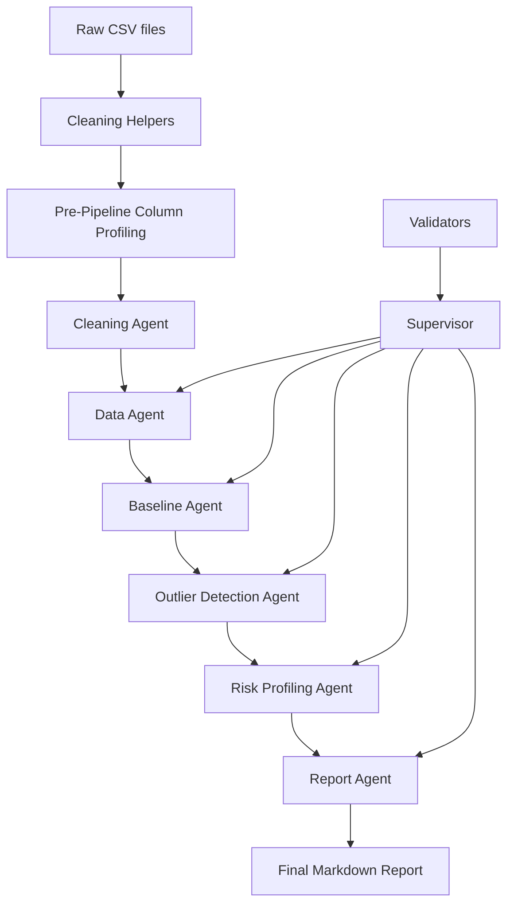

The Multi-Agent Pipeline includes the following components:

### Cleaning Helpers

Reusable functions for:

- accent stripping;
- string normalization;
- missing-value detection;
- type inference;
- robust parsing of noisy values.

### Column Profiling

Before executing the pipeline, each dataset is profiled to understand:

- column names;
- dominant formats;
- missing values;
- likely semantic meaning of each field;
- sample values.

This profiling phase helps the agents reason about the structure of the input datasets.

### Code Executor

The Code Executor receives task instructions and generates executable Python code.  
It is constrained to return only executable Python code, without explanations or markdown.

### Validators

Each agent output is checked by deterministic validators.  
This is a key design choice because it reduces the risk of accepting invalid LLM-generated outputs.

The validators check whether:

- the expected output file exists;
- the file is loadable;
- required columns are present;
- the dataframe is not empty;
- the values satisfy basic consistency rules.

### Supervisor

The Supervisor orchestrates the execution of each agent.

For every task, it:

1. sends the task prompt to the Code Executor;
2. runs the generated code;
3. validates the output;
4. retries if execution or validation fails;
5. stores logs, generated code, validation results, and success status.

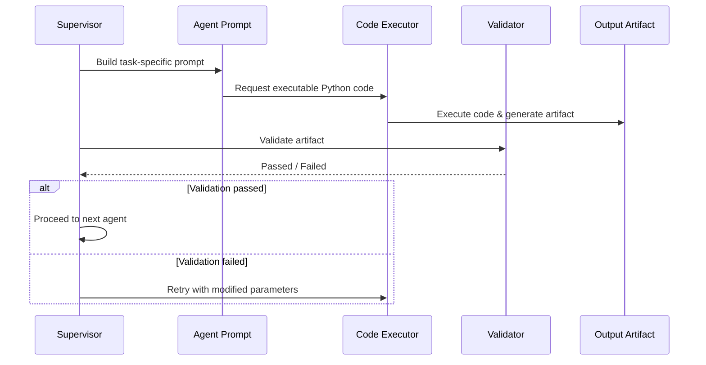

---

## Multi-Agent Components

### Data Agent

The Data Agent filters the cleaned transit datasets based on a natural language query.

In the notebook, the example query is:

```text
show me anomaly routes departing from Albania
```

The agent:

- selects the most appropriate dataset;
- identifies the correct departing country column;
- maps the query to the value `Albania`;
- filters records related to routes departing from Albania;
- focuses on alarm-related records;
- writes the result to `scope_manifest.json`.

For the example query, the Data Agent understood that it has to look for Fiumicino as arrival airport

---

### Baseline Agent

The Baseline Agent builds a route-level baseline from the scoped data.

It:

- loads `scope_manifest.json`;
- identifies departure and arrival columns;
- builds a route feature of the whole dataset;
- aggregates by route, considering all the possible ones;
- computes total alarms;
- computes number of records;
- computes alert rate;
- computes baseline statistics;
- writes `baseline_data.csv` for all the routes and `scoped_keys.json` only for those ones arriving at Fiumicino airport.

The Baseline Agent produced:

```text
835 routes and 11 columns
```

---

### Outlier Detection Agent

The Outlier Detection Agent loads the baseline data and the json file, and computes anomaly signals.

It uses:

- `z_score`;
- `local_outlier_factor`;
- `isolation_forest`.

It then selects the top 5% most anomalous routes.

For the Albania query, it produced:

```text
6 outliers
```

The detected routes were:

| Route      | IF Anomaly | LOF Anomaly | Z-score Anomaly |
|------------|-----------|-------------|-----------------|
| TIA → VRN  | True      | False       | True            |
| TIA → BGY  | True      | False       | True            |
| TIA → BLQ  | True      | False       | True            |
| TIA → PSA  | True      | False       | True            |
| TIA → MXP  | True      | False       | True            |
| TIA → TSF  | True      | False       | True            |

---

### Risk Profiling Agent

The Risk Profiling Agent converts statistical outliers into operational risk categories.

For the Albania query, all detected routes were classified as HIGH risk.

This indicates that the identified anomalies are both statistically significant and operationally relevant.

This highlights a key design principle of the Multi-Agent Pipeline: separating anomaly detection from risk prioritization.  
While many routes may show statistical deviations, only those with strong and consistent signals are elevated to high-risk status.

---

### Report Agent

The Report Agent generates a final narrative report in markdown format.

The report includes:

- executive summary;
- risk distribution;
- top high-risk routes;
- other monitored routes;
- main anomaly drivers;
- interpretation of the results.

For the example query, the report summarized:

- 6 flagged routes;
- 6 HIGH risk routes;
- 0 MEDIUM risk routes;
- 0 LOW risk routes.

---

## [Section 3] Experimental Design

## Experiment 1 — Classical Pipeline Anomaly Detection

### Purpose

The purpose of this experiment is to evaluate whether a manually designed unsupervised pipeline can identify route-level anomalies from the available operational and traveller-related datasets.

### Baselines

The baseline is the global cross-sectional distribution of all 366 routes.

The anomaly detection methods compared are:

- Isolation Forest;
- Local Outlier Factor;
- Z-score.

### Metrics

Since no reliable ground truth labels are available, the evaluation focuses on unsupervised and operational metrics:

- number of flagged anomalies;
- percentage of flagged anomalies;
- agreement between methods;
- number of consensus anomalies;
- interpretability of flagged routes;
- operational usefulness after post-processing.

---

## Experiment 2 — Consensus Voting

### Purpose

The purpose of this experiment is to reduce false positives and obtain a more robust anomaly set by combining multiple anomaly detection signals.

### Baseline

The main comparison is against each single detector:

- Isolation Forest alone;
- LOF alone;
- Z-score alone.

### Evaluation Logic

A route is considered a final anomaly only if at least two out of three methods flag it.

This allows the pipeline to:

- preserve strong anomaly signals;
- reduce the noise introduced by overly sensitive methods;
- obtain a smaller and more actionable anomaly set.

---

## Experiment 3 — Risk Post-Processing

### Purpose

The purpose of this experiment is to transform raw anomaly flags into operational risk categories.

### Baseline

The baseline is the set of 24 consensus anomalies.

### Evaluation Logic

The post-processing step evaluates:

- alert rate;
- absolute alarms;
- investigated passenger volume;
- anomaly votes;
- confidence intervals;
- data quality notes.

The final output is a ranked set of reliable routes with a priority score.

---

## Experiment 4 — Multi-Agent Pipeline

### Purpose

The purpose of this experiment is to evaluate whether an agent-based system can reproduce parts of the anomaly detection workflow in a more automated and modular way.

### Baseline

The baseline is the Classical Pipeline.

### Evaluation Criteria

The Multi-Agent Pipeline is evaluated in terms of:

- ability to interpret a natural language query;
- ability to select and filter the correct dataset;
- ability to build a route-level baseline;
- ability to detect outliers;
- ability to assign risk levels;
- ability to generate a final textual report;
- robustness through deterministic validation.

---

# Results Section

## [Section 4] Results

This section reports and compares the results obtained from the two anomaly detection approaches developed in the project.

The comparison is performed on the full dataset. This is important because earlier agentic experiments were query-driven and focused on a narrower operational scope. The current Multi-Agent results are instead based on the complete available data, making the comparison with the Classical Pipeline more meaningful.

---

## 4.1 Classical Pipeline Results

The Classical Pipeline analyzed:

```text
366 total routes
```

with:

```text
30 engineered numerical features
```

Each route represents a departure-arrival airport pair. The feature matrix was built through manual cleaning, aggregation, feature engineering, logarithmic transformation, and standard scaling.

The main goal of the Classical Pipeline was to identify route-level anomalies using multiple complementary detection methods. Three anomaly signals were computed:

- **Isolation Forest**, to identify routes that are globally isolated in the feature space;
- **Local Outlier Factor**, to identify routes that are unusual compared with their local neighborhood;
- **Z-score**, to identify feature-level extreme deviations.

The individual anomaly detectors produced the following results:

| Method | Anomalies detected | Percentage |
|---|---:|---:|
| Isolation Forest | 19 / 366 | 5.2% |
| Local Outlier Factor | 19 / 366 | 5.2% |
| Z-score | 137 / 366 | 37.4% |

The results show a clear difference in sensitivity between model-based detectors and the statistical Z-score rule.

Isolation Forest and Local Outlier Factor both detected 19 anomalous routes, which corresponds to approximately 5.2% of the dataset. This is consistent with the contamination parameter used during modeling and indicates that both methods behave conservatively.

The Z-score method, instead, detected 137 anomalous routes, corresponding to 37.4% of the dataset. This confirms that Z-score is much more sensitive, especially in a dataset where several features are sparse, skewed, and affected by low-volume route behavior.

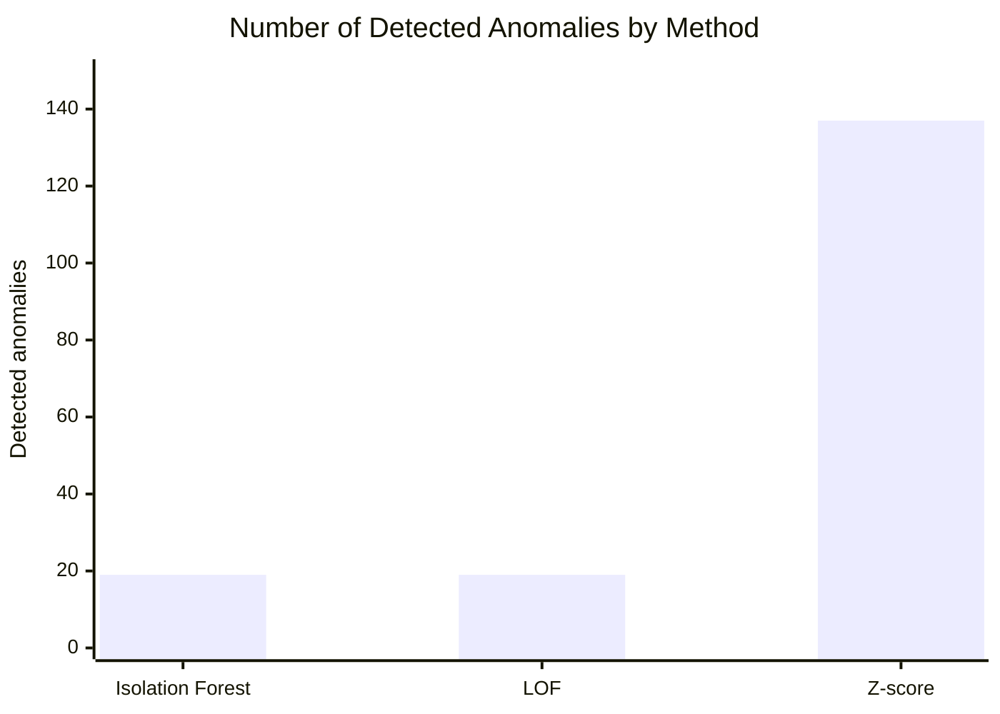

### Interpretation of Individual Detectors

The three detectors provide different perspectives on anomaly detection.

| Detector | Main behavior | Interpretation |
|---|---|---|
| Isolation Forest | Conservative | Captures routes that are globally isolated from the rest of the dataset |
| Local Outlier Factor | Conservative | Captures routes that are locally unusual compared with similar routes |
| Z-score | Highly sensitive | Captures individual feature deviations, including many weak or noisy signals |

The strong difference between Z-score and the other two methods indicates that many routes contain at least one extreme feature value, but not all of them are strong multivariate anomalies.

For this reason, the Classical Pipeline does not rely on a single detector. Instead, it combines the outputs through a consensus mechanism.

---

### Consensus Voting

Each detector assigns a binary anomaly flag to each route:

```text
1 = anomalous
0 = normal
```

The final anomaly score is based on the number of anomaly votes received by each route.

The vote distribution was:

| Number of votes | Routes | Interpretation |
|---:|---:|---|
| 0 | 216 | No anomaly signal |
| 1 | 126 | Weak anomaly signal |
| 2 | 23 | Probable anomaly |
| 3 | 1 | Strong anomaly signal |

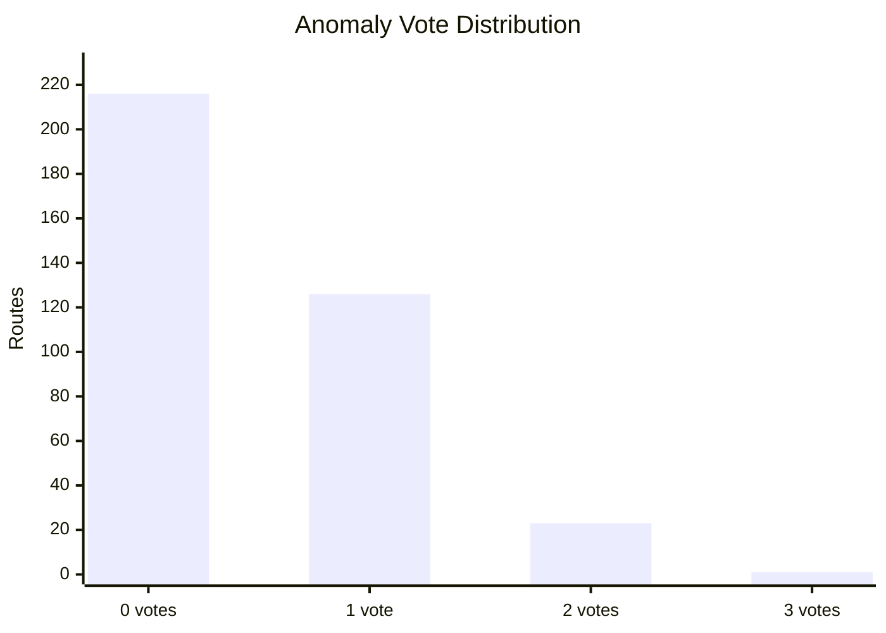

The consensus rule was defined as:

```text
A route is considered a final anomaly if it receives at least 2 votes out of 3.
```

This produced:

```text
24 final consensus anomalies
```

The consensus approach reduced the anomaly set from:

```text
137 Z-score flags → 24 consensus anomalies
```

This reduction is one of the most important outcomes of the Classical Pipeline. It shows that combining multiple detectors helps reduce noise and avoids treating every feature-level deviation as an operationally relevant anomaly.

---

### Classical Pipeline Summary

| Result | Value |
|---|---:|
| Total routes analyzed | 366 |
| Engineered features | 30 |
| Isolation Forest anomalies | 19 |
| LOF anomalies | 19 |
| Z-score anomalies | 137 |
| Consensus anomalies | 24 |
| Consensus threshold | At least 2 out of 3 votes |

The Classical Pipeline therefore provides a broad but controlled anomaly detection framework. It captures many possible abnormal behaviors while using consensus voting to filter out weaker signals.

---

## 4.2 Risk Classification Results

The 24 consensus anomalies were further analyzed through a post-processing and risk classification step.

The objective of this phase was to transform raw anomaly flags into operationally interpretable risk levels. This is necessary because an anomaly detection model can identify statistically unusual routes, but statistical unusualness is not always equivalent to operational risk.

The post-processing step considered several factors:

- number of anomaly votes;
- alert rate;
- absolute number of alarms;
- number of investigated travellers;
- data completeness;
- confidence and reliability of the signal;
- possible low-volume effects;
- interpretability of the anomaly drivers.

The 24 consensus anomalies were classified as follows:

| Risk level | Routes |
|---|---:|
| CRITICAL | 1 |
| HIGH | 10 |
| MEDIUM | 7 |
| LOW | 6 |

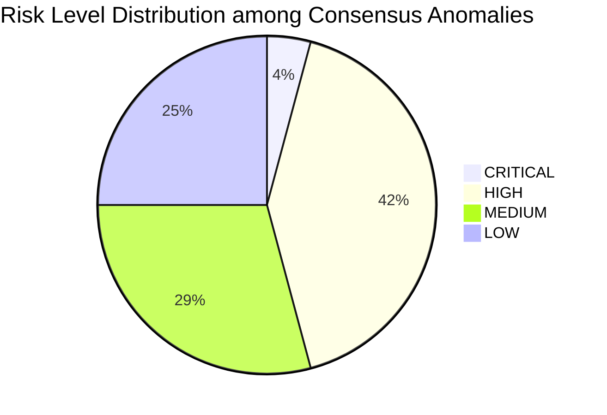

The risk distribution shows that most consensus anomalies are not simply low-level statistical deviations. A large portion of the final anomaly set falls into the CRITICAL or HIGH categories, meaning that the consensus mechanism successfully preserves relevant routes while reducing the noise introduced by Z-score alone.

---

### Data-Quality Filtering

After assigning risk levels, the Classical Pipeline applied an additional reliability filter.

After data-quality filtering:

```text
19 reliable routes
```

were retained for the final operational report.

The post-processing step excluded or marked with caution the following cases:

| Issue type | Routes |
|---|---:|
| Likely false positives | 3 |
| Incomplete data | 2 |
| High rate but very low volume | 5 |

These categories are important because anomaly detection on operational data is sensitive to both volume and data quality.

A route may appear anomalous because it has a very high alert rate, but if the number of observations is very small, the estimate may be unstable. Similarly, routes with incomplete supporting information may be statistically interesting but less reliable for operational decision-making.

---

### Risk Classification Interpretation

The risk classification adds an operational layer on top of the statistical anomaly detection layer.

| Risk level | Meaning |
|---|---|
| CRITICAL | Strongest anomaly signal, usually supported by all detectors or extreme operational indicators |
| HIGH | Strong anomaly signal with relevant operational evidence |
| MEDIUM | Meaningful deviation, often linked to volume or partial anomaly evidence |
| LOW | Weak or lower-priority signal, useful mainly for monitoring |

This step makes the final output more usable because it separates routes that require immediate attention from routes that should simply be monitored.

---

## 4.3 Main Classical Pipeline Findings

The Classical Pipeline produced several important findings.

### 1. Z-score is highly sensitive

The Z-score method detected:

```text
137 anomalous routes
```

This is much higher than the number of anomalies detected by Isolation Forest and Local Outlier Factor.

This behavior is expected because Z-score flags a route when at least one feature exceeds a statistical threshold. In a dataset with 30 features, sparse values, and skewed route distributions, many routes may exceed the threshold for at least one variable.

As a result, Z-score is useful for identifying feature-level deviations, but it is too sensitive to be used alone for final operational decisions.

---

### 2. Isolation Forest and LOF are more selective

Both Isolation Forest and Local Outlier Factor detected:

```text
19 anomalous routes
```

This indicates that the two model-based methods are more conservative.

Isolation Forest focuses on global isolation, while LOF focuses on local density differences. Their similar anomaly counts suggest that both methods identify a small set of routes that are structurally different from the majority of the dataset.

---

### 3. Consensus voting improves reliability

The consensus strategy produced:

```text
24 final anomalies
```

This final set is much smaller than the Z-score output and more interpretable than any single-detector result.

Consensus voting improves reliability because a route must be confirmed by at least two independent anomaly signals before being selected as a final anomaly.

---

### 4. Risk post-processing is necessary

The Classical Pipeline shows that raw anomaly flags are not sufficient.

A route may be statistically anomalous for several reasons:

- high alert rate;
- high absolute alarm volume;
- rare feature pattern;
- low data volume;
- incomplete supporting records;
- isolated but operationally weak signal.

For this reason, post-processing is essential to distinguish between statistical anomalies and operationally relevant anomalies.

---

### 5. High alert rate does not always mean high reliability

Some routes have very high alert rates but very low investigated volume.

In these cases, the alert rate may be unstable because it is calculated on a small number of observations. These routes should not automatically be treated as high-risk without further validation.

---

### 6. High-volume routes can be operationally important even with moderate rates

Some medium-risk routes may not have the highest alert rate, but they may generate a large number of absolute alarms.

From an operational perspective, these routes can be important because they may consume more resources or indicate repeated patterns across many observations.

---

### Classical Pipeline Final Assessment

Overall, the Classical Pipeline is strong in terms of:

- methodological rigor;
- feature richness;
- transparency;
- interpretability;
- robustness through consensus;
- ability to detect both strong and subtle anomalies.

Its main limitation is that it requires significant manual effort and careful post-processing.

---

## 4.4 Multi-Agent Pipeline Results

The Multi-Agent Pipeline was executed in a query-driven setting (“show me anomaly routes in general”), focusing on a scoped subset of the data rather than the full dataset.

The objective of the Multi-Agent Pipeline differs from the Classical Pipeline. Instead of manually defining each step, the system automates the anomaly detection workflow through specialized agents.

The workflow includes:

| Step | Description |
|---|---|
| Data Agent | Selects, filters, and structures relevant alarm-related and traveller-related records |
| Baseline Agent | Builds route-level aggregates and computes population-level baseline statistics |
| Outlier Detection Agent | Computes anomaly signals such as z-score, ratio-to-baseline, and anomaly score |
| Risk Profiling Agent | Assigns risk levels based on anomaly severity and ranking |
| Report Agent | Generates the final anomaly detection report in markdown format |

The Multi-Agent Pipeline identified:

```
13 anomalous route-level groups
```

The risk distribution was:

| Risk level | Routes |
|---|---:|
| HIGH | 4 |
| MEDIUM | 3 |
| LOW | 6 |

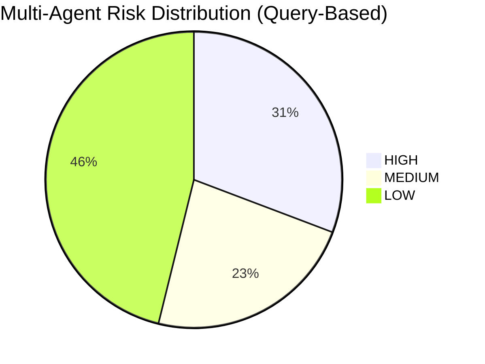

The anomalies were selected using a population-level baseline, z-score normalization, ratio-to-baseline comparison, and hybrid filtering logic combining top-ranked deviations with a confidence threshold.

Compared to the full-dataset analysis, this query-driven approach produces a smaller and more focused set of anomalies, highlighting its suitability for operational monitoring and rapid decision-making.

---

### Multi-Agent High-Risk Routes

The Multi-Agent Pipeline identified **4 high-risk routes**.

| Route      | Z-score | Ratio to baseline |
|------------|--------|------------------|
| TIA → BGY  | 9.05   | 293.0x           |
| TIA → BLQ  | 7.79   | 228.0x           |
| TIA → PSA  | 7.07   | 193.0x           |
| TIA → MXP  | 6.15   | 216.0x           |

These routes show the strongest and most consistent deviations from the population baseline.

They combine:
- high statistical deviation (z-score)
- very large relative magnitude (ratio to baseline)

This makes them both statistically significant and operationally relevant.

These routes should be prioritized for immediate investigation.

---

### Multi-Agent Medium-Risk Routes

The Multi-Agent Pipeline identified **3 medium-risk routes**.

| Route      | Z-score | Ratio to baseline |
|------------|--------|------------------|
| TIA → FCO  | 2.09   | 223.0x           |
| TIA → TSF  | 4.14   | 174.0x           |
| TIA → GOA  | 2.41   | 75.0x            |

These routes present clear deviations from the baseline but are ranked below the high-risk group.

They typically show:
- strong relative deviations  
- but lower statistical confidence or consistency  

These routes should be monitored and evaluated depending on operational priorities.

---

### Multi-Agent Low-Risk Routes

The Multi-Agent Pipeline identified **6 low-risk routes**.

| Route      | Z-score | Ratio to baseline |
|------------|--------|------------------|
| TIA → BRI  | 1.54   | 121.0x           |
| TIA → VRN  | 13.22  | 89.0x            |
| LHR → LIN  | 1.61   | 98.0x            |
| LGW → MXP  | 13.54  | 86.0x            |
| TIA → TRN  | 2.91   | 80.0x            |
| TIA → CIA  | 1.92   | 79.0x            |

These routes are not ignored, but they are not assigned immediate priority.

Some of them still show strong statistical signals (e.g., high z-score), but are ranked lower due to:
- weaker consistency across signals  
- lower relative impact  
- or reduced operational relevance  

This illustrates a key feature of the Multi-Agent Pipeline: it separates **statistical anomaly strength** from **operational prioritization**, focusing attention on the most actionable cases.

### Multi-Agent Pipeline Summary

| Result | Value |
|---|---:|
| Total anomalies detected | 13 |
| High-risk routes | 4 |
| Medium-risk routes | 3 |
| Low-risk routes | 6 |
| Main detection signals | Z-score, ratio-to-baseline, anomaly score |
| Main selection logic | Hybrid ranking and confidence threshold |

The Multi-Agent Pipeline is highly selective and focuses on the most relevant baseline deviations, producing a compact and actionable set of routes for analysis.

---

## 4.5 Classical vs Multi-Agent Comparison

The two pipelines are compared considering their different operational roles.

| Dimension | Classical Pipeline | Multi-Agent Pipeline |
|---|---|---|
| Scope | Full dataset | Query-driven subset |
| Total routes analyzed | 366 routes | Filtered route-level groups |
| Feature representation | 30 engineered numerical features | Aggregated volume-based metrics |
| Detection methods | Isolation Forest, LOF, Z-score | Z-score, ratio-to-baseline, anomaly score |
| Selection strategy | Consensus voting | Ranking and prioritization |
| Raw anomaly sensitivity | High (captures many signals) | Lower (focus on strongest signals) |
| Final anomaly set | 24 consensus anomalies | 13 selected anomalies |
| Risk profiling | Detailed post-processing | Automated prioritization |
| Interpretability | High | High |
| Automation | Lower | Higher |
| Manual effort | High | Lower once configured |
| Main strength | Broad anomaly discovery | Focused and actionable detection |
| Main weakness | Time-consuming | Lower coverage of subtle patterns |

---

### Quantitative Comparison

| Metric | Classical Pipeline | Multi-Agent Pipeline |
|---|---:|---:|
| Total routes analyzed | 366 | Query-based subset |
| Raw statistical anomalies | 137 | 13 |
| Final anomalies | 24 | 13 |
| High / Critical risk routes | 11 | 4 |
| Medium risk routes | 7 | 3 |
| Low risk routes | 6 | 6 |

The Classical Pipeline identifies a larger set of anomalies due to its multi-model approach and rich feature space.

The Multi-Agent Pipeline produces a smaller and more focused set of anomalies, prioritizing only the most significant deviations from the baseline.

This reflects a fundamental trade-off:

- Classical Pipeline → coverage and robustness  
- Multi-Agent Pipeline → selectivity and operational usability

---

### Risk Distribution Comparison

| Risk level | Classical Pipeline | Multi-Agent Pipeline |
|---|---:|---:|
| CRITICAL | 1 | 0 |
| HIGH | 10 | 4 |
| MEDIUM | 7 | 3 |
| LOW | 6 | 6 |
| Total | 24 | 13 |

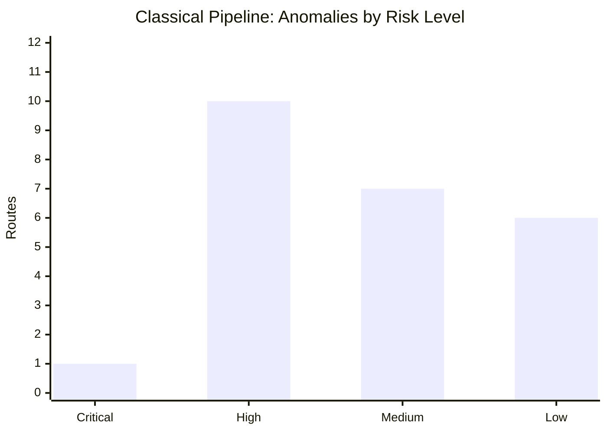

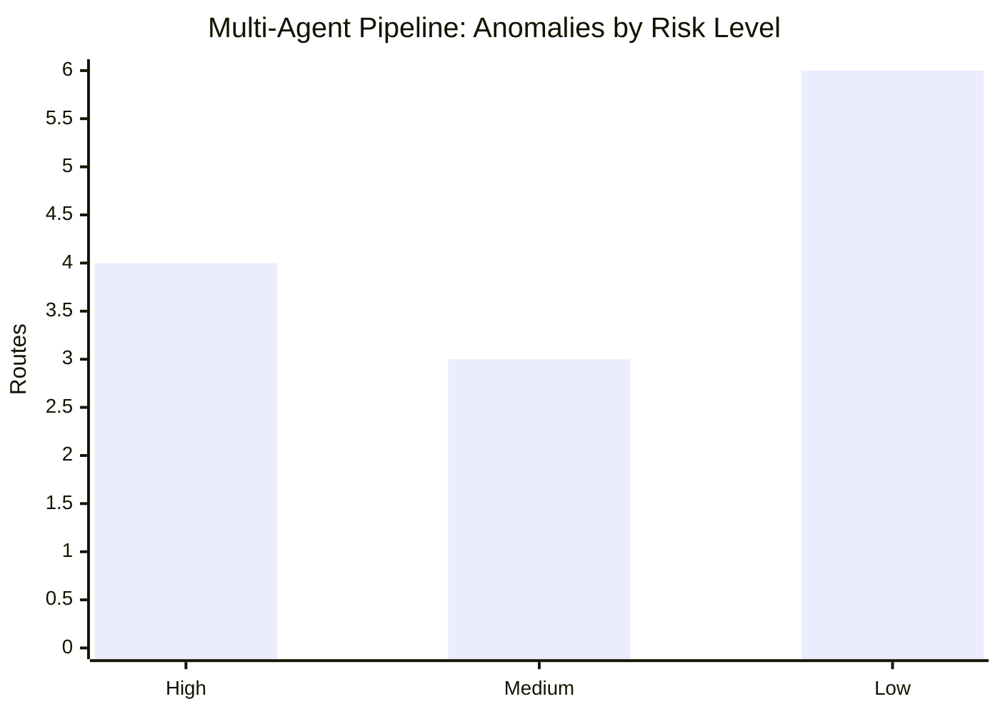

The Classical Pipeline shows a broader distribution across all risk levels, including critical cases, reflecting its higher coverage and sensitivity to a wide range of anomaly patterns.

The Multi-Agent Pipeline produces a more compact and balanced distribution. While it identifies fewer anomalies overall, a larger proportion is classified as high or medium risk compared to the total.

This indicates that the Multi-Agent system is not simply replicating the Classical Pipeline, but applying a different prioritization logic: it filters the anomaly space more aggressively and focuses on the most operationally relevant cases.

---

### Detection Behavior Comparison

The Classical Pipeline captures several types of anomalies:

- routes that are globally isolated in the full feature space;
- routes that are locally unusual compared with similar routes;
- routes with extreme feature-level values;
- routes supported by multiple independent anomaly signals.

The Multi-Agent Pipeline mainly captures:

- extreme deviations from a population-level baseline;
- unusually high event volumes;
- high ratio-to-baseline values;
- strongly ranked route-level outliers.

This means that the Classical Pipeline is more suitable for discovering a wide anomaly space, while the Multi-Agent Pipeline is more suitable for producing a concise operational alert list.

---

### Coverage vs Selectivity

The two approaches reflect a trade-off between coverage and selectivity.

| Objective | Better suited pipeline | Reason |
|---|---|---|
| Discover many possible anomalies | Classical Pipeline | Uses multiple detectors and richer features |
| Reduce alert fatigue | Multi-Agent Pipeline | Produces a smaller anomaly set |
| Capture multivariate patterns | Classical Pipeline | Uses 30 engineered features |
| Automate repeated analysis | Multi-Agent Pipeline | Agentic workflow can generate outputs automatically |
| Explain final risk levels | Both | Both include risk interpretation, but with different logic |
| Operational triage | Multi-Agent Pipeline | Focuses on fewer, ranked deviations |
| Methodological validation | Classical Pipeline | More controlled and transparent |

---

## 4.6 Interpretation of the Comparison

The comparison shows that the Classical Pipeline and the Multi-Agent Pipeline are not interchangeable. They are complementary tools designed around different priorities.

The Classical Pipeline is designed for analytical completeness. It builds a rich feature matrix, applies multiple anomaly detectors, and uses consensus voting to identify robust final anomalies. This makes it strong for methodological validation and for discovering subtle patterns that may not be visible through simple aggregate metrics.

The Multi-Agent Pipeline is designed for automation and operational usability. It processes the data through specialized agents, computes baseline deviations, ranks anomalous route groups, assigns risk levels, and generates a structured report. This makes it strong for repeatable monitoring and rapid anomaly review.

---

### Main Interpretation

The Classical Pipeline detected:

```
24 final consensus anomalies
```

The Multi-Agent Pipeline detected:

```
13 anomalous route-level groups
```

This difference should not be interpreted as a contradiction, but as a result of different methodological approaches.

The Classical Pipeline provides broader coverage by combining multiple detection methods and a rich feature space, capturing a wide range of anomaly patterns.

The Multi-Agent Pipeline is more selective, focusing on the most extreme and operationally relevant deviations through baseline comparison and ranking logic.

This highlights a key insight: the two pipelines are complementary rather than alternative, serving different analytical purposes.

---

### Practical Meaning

From a practical perspective:

- the Classical Pipeline is better when the goal is to understand the full anomaly landscape;
- the Multi-Agent Pipeline is better when the goal is to produce a short and actionable list of suspicious routes;
- the Classical Pipeline is more suitable for research and validation;
- the Multi-Agent Pipeline is more suitable for automation and operational monitoring.

---

### Strengths of the Classical Pipeline

The main strengths of the Classical Pipeline are:

- rich feature engineering;
- multiple anomaly detection perspectives;
- consensus-based robustness;
- transparent manual design;
- detailed post-processing;
- better coverage of subtle anomaly patterns.

Its main weakness is that it requires more manual effort and is less immediately reusable for interactive analysis.

---

### Strengths of the Multi-Agent Pipeline

The main strengths of the Multi-Agent Pipeline are:

- automated execution;
- modular agent-based structure;
- compact anomaly output;
- strong interpretability of baseline deviations;
- lower manual effort once configured;
- suitability for repeated operational use.

Its main weakness is that it may miss subtle multivariate anomalies that are not expressed as extreme aggregate deviations.

---

### Final Interpretation

The most important conclusion is that the two approaches should be combined rather than treated as alternatives.

A strong future version of the system would use:

- the feature richness of the Classical Pipeline;
- the consensus voting logic of the Classical Pipeline;
- the automation and modularity of the Multi-Agent Pipeline;
- the reporting capabilities of the Multi-Agent Pipeline.

This would allow the system to preserve methodological rigor while becoming more scalable, automated, and operationally useful.

---

### Final Takeaway

The final takeaway is:

```text
Classical Pipeline = coverage, rigor, and robustness
Multi-Agent Pipeline = selectivity, automation, and operational usability
```

The Classical Pipeline is the stronger tool for discovering and validating anomalies.

The Multi-Agent Pipeline is the stronger tool for automating anomaly detection and generating concise operational reports.

Together, they provide a complete framework for route-level anomaly detection on airport transit data.


## [Section 5] Conclusions

This project shows that anomaly detection on airport transit data requires both statistical modeling and careful post-processing. The Classical Pipeline demonstrates that different anomaly detection methods can produce very different levels of sensitivity: Isolation Forest and LOF detect a small and controlled set of anomalies, while Z-score identifies many more feature-level deviations. The consensus strategy provides a practical compromise by selecting only routes flagged by at least two methods, reducing the anomaly set from 137 Z-score flags to 24 consensus anomalies. After additional data-quality filtering, 19 reliable routes are retained for operational interpretation.

The Multi-Agent Pipeline demonstrates that the same type of workflow can be partially automated through specialized agents, deterministic validators, and a supervisor mechanism. The agentic system can interpret a natural language query, filter the relevant data, build a route-level baseline, detect outliers, assign risk categories, and generate a narrative report. This makes the approach promising for interactive analysis and repeated operational use.

Overall, the main takeaway is that the Classical Pipeline offers greater methodological control and interpretability, while the Multi-Agent Pipeline offers greater modularity and automation. A strong future direction would be to combine the two approaches: use the robust feature engineering and consensus logic of the Classical Pipeline inside the automated structure of the Multi-Agent Pipeline.

---

## Limitations and Future Work

The main limitations of the project are:

- the absence of a reliable ground-truth label for anomalies;
- the limited temporal window available in the data;
- the need to rely on unsupervised evaluation criteria;
- the sensitivity of some results to low-volume routes;
- the possibility of false positives caused by rare but not necessarily risky feature patterns;
- the current difference in scope between the full Classical Pipeline and the query-driven Multi-Agent Pipeline.

Future work could include:

- collecting a longer historical time window;
- introducing time-series baselines and seasonal decomposition;
- validating detected anomalies with domain experts;
- adding supervised labels if confirmed anomaly cases become available;
- integrating the Classical Pipeline's consensus logic into the Multi-Agent Pipeline;
- improving the Risk Profiling Agent with confidence intervals and data-quality flags;
- extending the Gradio interface for interactive exploration;
- generating all final README figures automatically from the notebook.

---

## Repository Structure

```text
.
├── main.ipynb
├── README.md
├── data/
│   └── raw/
│       ├── ALLARMI.csv
│       └── TIPOLOGIA_VIAGGIATORE.csv
├── output/
│   ├── scoped_transit_data.csv
│   ├── baseline_data.csv
│   ├── outliers.csv
│   ├── risk_report.csv
│   └── transit_anomaly_report.md
└── requirements.txt
```

---

## Reproducibility

To reproduce the project:

1. Clone the repository.
2. Place the raw datasets in `data/raw/`.
3. Install the required dependencies.
4. Run `main.ipynb` from top to bottom.
5. Ensure that all generated figures are saved in the `images/` folder.
6. Verify that the output artifacts are created correctly.

Example installation:

```bash
pip install -r requirements.txt
```

# API Key

This project requires a Mistral API key to run the Multi-Agent Pipeline.

For the purpose of evaluation, the API key is provided below:

```bash
MISTRAL_API_KEY=6H9hgqBwYfQSjKp37F5zr1TWnyMTYitV
```

To use it locally, set it as an environment variable:

```bash
export MISTRAL_API_KEY=6H9hgqBwYfQSjKp37F5zr1TWnyMTYitV
```


Main Python libraries used:

- `pandas`
- `numpy`
- `scipy`
- `scikit-learn`
- `matplotlib`
- `seaborn`
- `gradio`
- `python-dotenv`
- `openai`

---

## Notes on Academic Integrity

This project was developed collaboratively by us and reflects our understanding of anomaly detection, data processing, and machine learning workflows.

### Use of AI Tools

During the development of this project, AI tools (including Large Language Models) were used as **support tools for coding and implementation**.

In particular, we:

- had a clear conceptual understanding of the pipeline design and methodology;
- defined the structure of both the Classical and Multi-Agent pipelines independently;
- used AI tools to assist in writing specific parts of the code when implementation details were unclear;
- relied on step-by-step guidance to translate ideas into working code.

AI assistance was therefore used mainly to:

- accelerate coding;
- clarify implementation patterns;
- debug or refine specific components.

---

### Human Contribution and Understanding

All key decisions in the project were made by us, including:

- problem formulation and anomaly detection strategy;
- choice of models and statistical methods;
- design of feature engineering and aggregation logic;
- definition of the consensus mechanism;
- interpretation of results and conclusions.

Every part of the generated code was:

- reviewed and understood by us;
- adapted when necessary;
- integrated into a coherent pipeline.

We did not blindly copy outputs, but used AI as a **learning and implementation support tool**.

---

### Validation and Responsibility

All results presented in this report were:

- validated through execution and consistency checks;
- compared across different methods (Classical vs Multi-Agent);
- interpreted critically by us.

The final responsibility for the correctness of the code, the analysis, and the conclusions lies entirely with us.

---

### External Libraries

The project uses standard open-source Python libraries such as:

- `pandas`, `numpy` for data processing;
- `scikit-learn` for anomaly detection models;
- `scipy`, `matplotlib`, `seaborn` for analysis and visualization.

These are used in a standard and appropriate way.

---

### Final Statement

We confirm that:

- the project reflects our own ideas and understanding;
- AI tools were used transparently as support for implementation;
- all outputs were reviewed, validated, and interpreted independently;
- the work complies with academic integrity guidelines.

AI tools were used to assist development, not to replace our reasoning or contribution.

### Multi-Agent Demo UI (Gradio)

To make the Multi-Agent pipeline easily explorable, we developed a **demo user interface using Gradio**.

This UI allows users to interact with the system in a simple and intuitive way by:
- entering a **natural language query** (e.g., selecting specific routes or contexts)
- automatically triggering the **end-to-end multi-agent pipeline**

Once the query is submitted, the interface provides:
-  **Structured results** (detected anomalies and risk scores)
-  A **full narrative report** generated by the agents
-  An interactive **3D globe animation** that visually highlights the selected routes

This demo showcases how the pipeline can be used in a **query-driven, interactive, and user-friendly way**, bridging the gap between advanced analytics and operational usability.