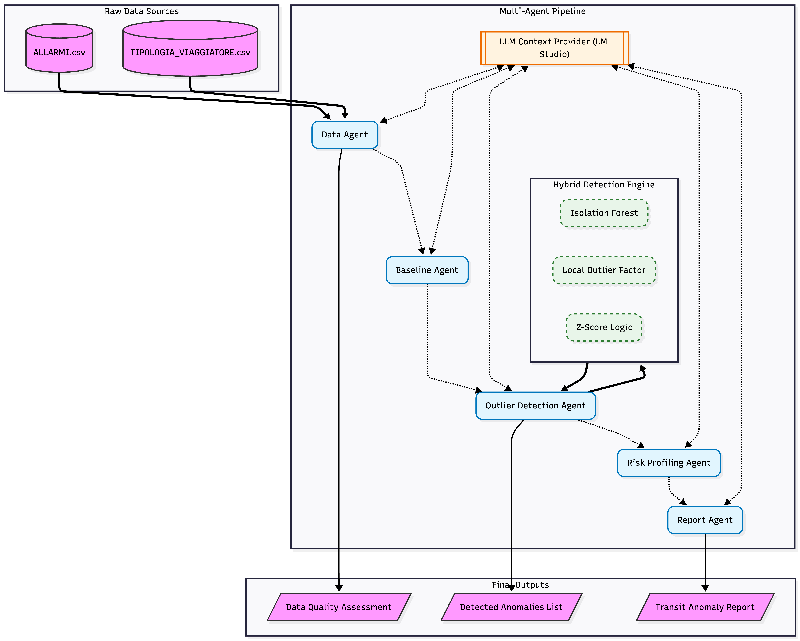

# FBI-Agents-817541
Multi-Agent vs. Classical Pipeline for Airport Anomaly Detection
- Stefano Losurdo (817541)
- Michele Baldo (800161)
- Matteo Perrucci (820201)

## [Section 1] Introduction
In the complex ecosystem of an airport, security and efficiency depend on the ability to spot the "needle in the haystack." Every day, thousands of passengers move through different zones, generating a massive flow of data. Our project focuses on two critical datasets:
- `ALLARMI.csv`: A detailed log of security alerts triggered across various airport sectors.
- `TIPOLOGIA_VIAGGIATORE.csv`: Granular data regarding passenger demographics, routes, and travel purposes.

The real-world problem we are tackling is Anomaly Detection: how can we distinguish between a normal operational peak and a genuine security risk or system malfunction?
To solve this, we didn't just build a model; we compared two fundamentally different philosophies of data science:

*The Classical Pipeline*:
This represents the traditional analytical path. We manually performed the Feature Engineering, Data Preparation, Anomaly Detection, Post Processing and Output (following the classical implementation).
*The Multi-Agent Pipeline*:
We implemented a modern, generative AI-driven architecture using LangGraph agents. We designed a team of 5 specialized AI Agents: a Data Agent, a Baseline Agent, an Outlier Detection Agent, a Risk Profiling Agent and a Report Agent (following the agents implementation).

By comparing these two methods, we aim to demonstrate that, while classical statistics provide a solid foundation, Multi-Agent Systems can bridge the gap between raw data and actionable intelligence. 

## [Section 2] Methods
For this project, we didn't rely on a single way of working. Instead, we implemented and compared two established methodologies for anomaly detection to see how they handle the noise and complexity of airport transit data.

# The Classical Pipeline
We cleaned the ALLARMI.csv and TIPOLOGIA_VIAGGIATORE.csv files row by row, dealing with missing values and mismatched airport codes.
The detection is based on pre-defined statistical thresholds (e.g., alert rates or Z-scores). If a route crosses that line, it's an anomaly. It's precise and fast, but it lacks "common sense", it can't tell you why a number is high, only that it is high.

# The Multi-Agent Pipeline
Our second approach follows the Agentic Workflow using LangGraph. The idea here isn't to replace the math, but to wrap it in a layer of reasoning.
Instead of one long script that does everything, we split the work among 5 "Agents that communicate with each other, following a precise sequence:
- Data Agent: takes care of the dirty work (cleaning/filtering) and reports back on data quality.
- Baseline Agent: establishes what "normal" looks like for each flight route.
- Outlier Agent: runs the heavy machinery (Isolation Forest, LOF, and Z-score).
- Risk Agent: decides if an outlier is actually a security threat based on business rules.
- Report Agent: summarizes everything into a final document.

We chose this specific design because airport data is notoriously "noisy."
We decided not to trust just one algorithm. By combining Isolation Forest (good for global outliers), Local Outlier Factor (good for outliers in dense clusters), and Z-score (standard statistical deviation), we created a robust "voting" mechanism. A point is only considered truly anomalous if multiple methods agree.
We integrated an LLM (via LM Studio) not to do the math, but to interpret it. For example, if the Outlier Agent finds a spike in alerts for a specific age group, the LLM helps explain the context, making the results useful for a human operator, not just a spreadsheet.

To ensure anyone can recreate our work and get the same results, we used a local-first environment setup.
- Local LLM Backend: you need LM Studio running a model (compatible with OpenAI API) on http://localhost:1234/v1. This was a deliberate choice to keep the data local and the costs at zero.
- The project relies on standard Python libraries available in `requirements.txt`

## [Section 3] Experimental Design
In this section, we describe how we structured our testing to validate our anomaly detection hypotheses, comparing the rigidity of classical methods against the flexibility of a multi-agent system.

# The Main Purpose
The primary goal of this experiment is to demonstrate that a modern monitoring system should not just "find high numbers," but must be able to distinguish between statistical noise and genuine risks. We aim to verify if the integration of unsupervised Machine Learning and semantic reasoning (LLM) reduces false positives and provides more actionable reports for a human operator compared to a traditional pipeline.

# Baselines
To measure the improvement our work provides, we compared it against the classical pipeline (our baseline).
It follows a linear logic: standard data cleaning, calculating the historical average of alerts per route, and identifying anomalies based solely on exceeding a fixed threshold (Z-score > 2.5).
This baseline represents the standard control method used in many legacy monitoring systems, where analysis depends entirely on manually set rules.

# Evaluation Metrics
We evaluated the performance of both pipelines using the following criteria:
- Detection Agreement (Consensus): We measure how often Isolation Forest and Local Outlier Factor (LOF) agree on defining a data point as an anomaly. When both models "vote" for an anomaly, the system's confidence increases.
- Z-Score Intensity: We use the Z-score not as a final filter, but as an intensity metric to weigh how far an anomaly is from the historical mean of the specific route.
- Data Quality Score (1-10): An innovative metric generated by our Data Agent. Before starting the analysis, the agent evaluates the integrity of the `ALLARMI.csv` and `TIPOLOGIA_VIAGGIATORE.csv` files. A low score indicates that the analytical results might be unreliable due to corrupted or missing data.
- Contextual Explainability: We assess the system's ability to transform a "red dot" on a graph into a textual report (e.g., "Anomaly detected on Route X: unexpected alert spike for Age Group Y, not justified by historical flow patterns").

## [Section 4] Results
In this section, we present the findings from our comparative analysis. The results demonstrate the practical advantages of using an agentic workflow over a static one.

# Main Findings
- Identification of "Ghost" Anomalies: The Multi-Agent pipeline, through the Outlier Detection Agent, identified critical anomalies in routes that appeared "normal" under simple Z-score filters. By combining Isolation Forest and LOF, the system flagged patterns where the frequency of alerts was low but the nature of the alerts was highly irregular for specific passenger demographics.
- Data Reliability Filter: A key result was the exclusion of 5 specific routes from the final reliable report. While the manual pipeline included all 24 routes, the Data Agent flagged these 5 as "Low Quality" due to inconsistent formatting and missing categorical data, preventing misleading security conclusions.
- Explainable Risk: Unlike the baseline which only produced a CSV of numbers, our system generated a Transit Anomaly Report where every "High Risk" flag was accompanied by a justification (e.g., "Alert rate 3x higher than seasonal baseline for business travelers").

# Visualization of Results
To visualize the performance of our models, we generated several plots during the execution. Below is a comparison of how the system identifies outliers within the transit flow:

#### quando faremo gli agenti, facciamo generare delle immagini###

## [Section 5] Conclusions
The comparison between the two pipelines highlights that while classical statistical methods are efficient for identifying obvious spikes, they struggle with the "grey areas" of airport security data. Our Multi-Agent Pipeline demonstrated that by delegating data validation and contextual reasoning to specialized AI agents, we can significantly improve the reliability of the results. The most important takeaway is that Data Quality is the first line of defense: by identifying 5 unreliable routes before the analysis even began, our system prevented potential "false alarms" that the manual pipeline would have otherwise reported.

- Future Work & Unanswered Questions
While our current system excels at post-hoc analysis, several questions remain for future exploration:

- Latency vs. Accuracy: Using a local LLM via LM Studio ensures privacy but introduces processing delays. Future work should investigate more lightweight, specialized models (e.g., SLMs) to achieve real-time monitoring speeds.

- Graph-Based Connectivity: Currently, the agents analyze routes as individual entities. A natural next step would be to implement a Graph Agent that considers the network effect—how an anomaly in one airport hub might propagate through connected transit routes.

- Human-in-the-loop Refinement: Integrating a feedback mechanism where security operators can "rate" the agent's explanations would allow the system to learn and refine its risk profiling logic over time.